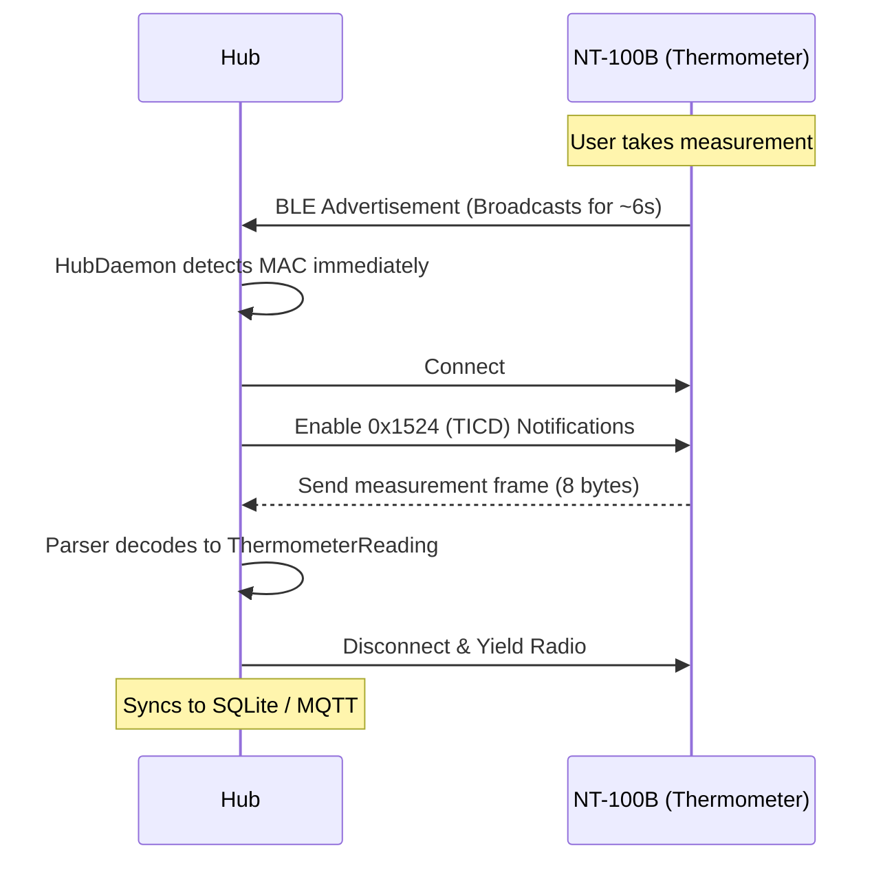
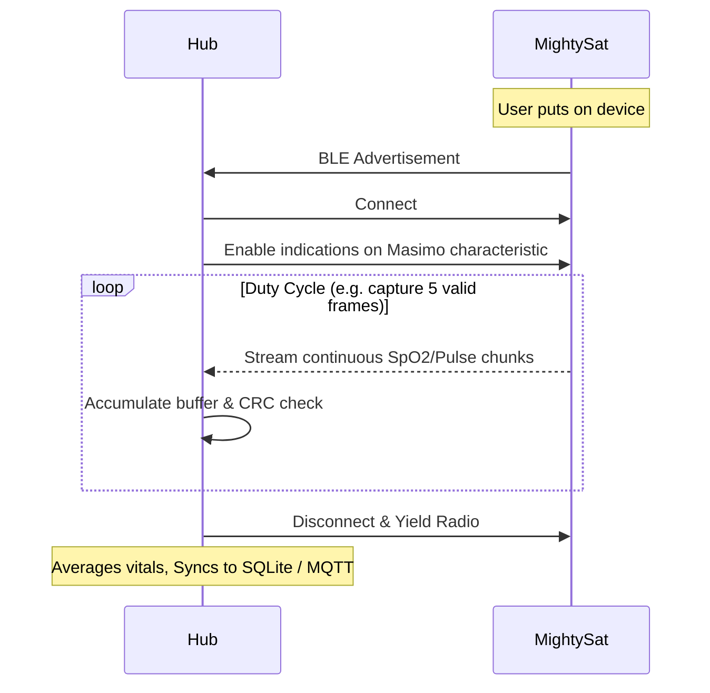
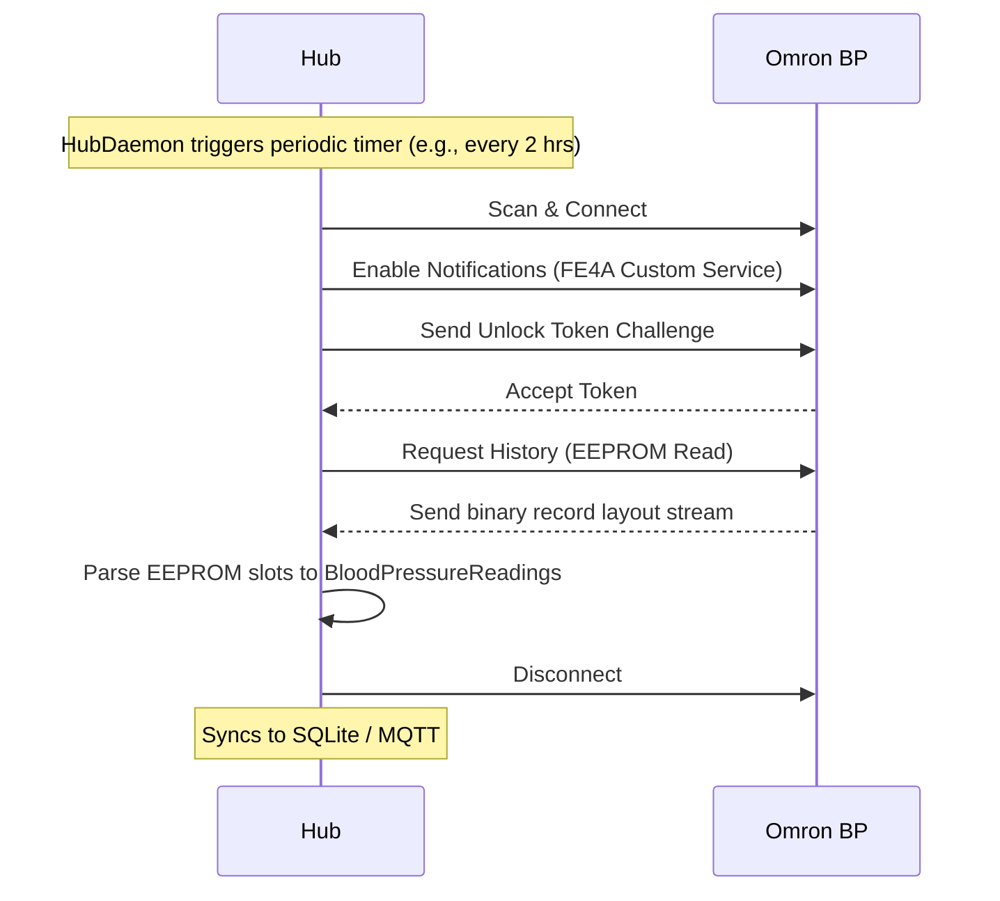

# SH3-PI — Project Agent Guide

**Audience:** Humans and coding agents working on this repo  
**Purpose:** Explain *what we built*, *why folders/files exist*, *how they interact*, and *what not to break*  
**Repo:** `sh3-pi` — multi-brand medical BLE hub (Pi + Windows)  
**Last structured for agents:** 2026-07-23  

---

## How to use this document

| If you need… | Read |
|--------------|------|
| Big picture + decisions | §1–§3 |
| Datasheets / phone HCI dumps | §4 |
| Toolkit backend (brands, parsers, hub) | §5 |
| Web UI / API / SQLite | §6 |
| Ops scripts / systemd / tests | §7 |
| Runtime call graphs | §8 |
| Safe edit rules | §9 |
| Adding a brand | §10 |

**Related docs (do not duplicate wholesale):**

| Doc | Role |
|-----|------|
| `README.md` | Quick start (Linux/Windows) |
| `LINUX.md` | Pi / BlueZ ops |
| `EXECUTION_PLAN.md` | Product phases, goals, non-goals, MQTT status |
| `migration_plan.md` | Plugin-architecture migration checklist |
| `medical_ble_toolkit/README.md` | HAL details + datasheet reuse matrix |
| `medical_ble_toolkit/SUPPORT_MATRIX.md` | Support levels A–D per device family |
| `medical_ble_web/README.md` | FastAPI routes |
| `AGENTS.md` / `CLAUDE.md` | GitNexus workflow hooks |

---

## 1. What this project is

We reverse-engineered multiple **consumer medical BLE devices** (blood pressure, SpO2, thermometer, glucose, etc.) so a **Raspberry Pi (or Windows PC)** can act like the vendor companion app:

1. **Scan** for devices  
2. **Pair / bond** once on this host (phone companion must be unpaired first for many brands)  
3. **Sync** history or **live-stream** vitals  
4. **Parse** proprietary or SIG payloads into structured readings  
5. **Store** in SQLite; show in a local web UI; optionally **MQTT** publish  

Two packages form the runtime:

```
medical_ble_toolkit/   ← standalone BLE HAL (connection, brand plugins, parsers, hub)
medical_ble_web/       ← FastAPI UI + job orchestrator + SQLite + MQTT bridge
```

Everything under `datasheets/` and `phoneblelog/` is **research evidence**, not imported at runtime.

---

## 2. Locked product decisions (agents must respect)

| Decision | Choice | Why |
|----------|--------|-----|
| Clinical store of truth | **SQLite** `medical_ble_web/data/poc.db` | Durable, simple on Pi |
| Pair inventory | SQLite `devices` (+ optional JSON mirrors) | Hub roster is paired-only |
| Supported catalog | Code (`profiles.py`, brand catalogs) | Ships with software |
| Access model | LAN browser → `http://<host>:8741` | Appliance, not public cloud |
| Parser purity | `parsers/*` + `common/sfloat|crc` have **no bleak/I/O** | Port to Kotlin later |
| Brand extension | `DevicePlugin` + register in `brands/__init__.py` | Orchestrator stays generic |
| Hub multi-device | MAC-strict match + duty-cycle policy | Avoid wrong-device sync |
| Unlock sequences | Field-proven; **do not rewrite** casually | Omron FE4A, MightySat stream, Nipro TICD, Beurer CCCD timing |
| Platforms | Linux BlueZ + Windows WinRT via **Bleak** | Dual-dev + Pi deploy |

**Non-goals (current):** full companion UI, clinical certification claims, public internet auth, collapsing all BLE into one god module.

---

## 3. High-level architecture

```
┌─────────────────────────────────────────────────────────────────┐
│  Phone / laptop browser  →  medical_ble_web (FastAPI :8741)     │
│       static/index.html     app.py  routes                      │
└───────────────────────────────┬─────────────────────────────────┘
                                │
                                ▼
┌─────────────────────────────────────────────────────────────────┐
│  ble_jobs.py  — single BLE job lock, scan/pair/sync/live/hub    │
│  db.py        — SQLite devices / sessions / readings            │
│  brands.py    — UI brand catalog                                │
│  mqtt_bridge  — optional publish health/readings                │
└───────────────────────────────┬─────────────────────────────────┘
                                │ get_plugin / MedicalBleClient
                                ▼
┌─────────────────────────────────────────────────────────────────┐
│  medical_ble_toolkit                                            │
│  ┌──────────┐  ┌────────────┐  ┌─────────┐  ┌────────────────┐  │
│  │ core/    │  │ brands/*   │  │ hub/    │  │ parsers/       │  │
│  │ plugin   │→│ Omron…     │  │ daemon  │  │ pure decode    │  │
│  │ registry │  │ Beurer…    │  │ policy  │  │ + parser.py    │  │
│  └──────────┘  └─────┬──────┘  └────┬────┘  └───────▲────────┘  │
│                      │              │               │           │
│                 ble_client /   ConnectionManager    │           │
│                 brand BLE stacks  scan→spawn────────┘           │
│  common/  (sfloat, crc, gatt_map, hexutil, winrt_errors)        │
└─────────────────────────────────────────────────────────────────┘
                                ▲
              Evidence only     │
┌───────────────────────────────┴─────────────────────────────────┐
│  datasheets/  vendor PDFs + RE MD                               │
│  phoneblelog/ S23 Ultra btsnoop findings + decode tools         │
└─────────────────────────────────────────────────────────────────┘
```

### Two inventory layers

| Layer | Meaning | Where |
|-------|---------|-------|
| **Supported** | What software *can* talk to | `profiles.py`, brand catalogs, `SUPPORT_MATRIX.md` |
| **Paired** | What is bonded to *this* host | SQLite `devices`, Nipro registry JSON, optional exports |

---

## 4. Research layer — `datasheets/` and `phoneblelog/`

### 4.1 Why this folder exists

Before writing drivers we collected:

1. **Vendor datasheets / SDKs** (PDFs) — official GATT layouts, command tables  
2. **Phone Bluetooth HCI dumps** (Samsung S23 Ultra) while the **official companion app** talked to the real device  
3. **Markdown analyses** that map dump ↔ PDF and extract implementable flags, UUIDs, and session order  

Agents should treat these as **source of truth for protocol intent**. Runtime code should match findings; if code and docs diverge, prefer field dumps + golden tests.

### 4.2 Root datasheets

| Path | What it is | Why it exists |
|------|------------|---------------|
| `datasheets/BLE_Medical_Device_Architecture_Reference.md` (+ `.pdf`) | Cross-brand systems analysis: session archetypes (episodic dump vs stream), similarity matrix, UUID catalogs | Design input for the unified HAL; **not** runtime |
| `datasheets/comment.txt` | Free-form notes | Scratch / human comments |

### 4.3 Beurer — `datasheets/beurer/`

| Path | Role |
|------|------|
| `BM54_transmissionprotocol_rev01…rev03.pdf` | Official BM54 BLE transmission protocol revisions |
| `btsnoop_hci_202607221152.cfa` / `.txt` | **Beurer BM54** phone HCI capture (companion ↔ cuff). `.txt` is human-readable decode |
| `btsnoop_hci_202607151125.cfa` / `.txt` | **Omron** dump (misfiled under beurer folder historically — do not treat as Beurer) |
| `BM54_PHONE_HCI_FINDINGS.md` | Canonical HCI analysis: MAC, company ID `0x0611`, BLP `0x1810` / `0x2A35` Indicate, passkey/SMP, CCCD, indication count |
| `BLE_PROTOCOL_ANALYSIS.md` | RE of HealthManager Pro APK: sync flow, Kable stack, mappers, multi-family notes |
| `MULTI_DEVICE_SUPPORT.md` | ~120 catalog models, protocol profile tiers (BP SIG ready; scale/glucose/etc. partial) |
| `TIER1_TIER2_PROTOCOLS.md` | Connect / CCCD / parse reference for implementable tiers |
| `_analyze_cfa.py` | Optional helper to slice CFA dumps |

**Decision captured:** BM54 is **standard BLP Indicate**, not Omron FE4A. Bond required before CCCD; measurement dumps arrive as indications after settle; no proprietary “download all” command for classic BP.

### 4.4 Nipro / SH3 pack — `datasheets/nipro/`

| Path | Role |
|------|------|
| `README.md` | Index of distilled findings vs large decompile trees (removed after extract) |
| `EXACT_PROTOCOL.md` / `.json` | Companion BLELib command frames & device paths (machine + human) |
| `EXACT_HW_SEQUENCES.md` | Connect / measure / transfer sequences per device class |
| `NIPRO_BLE_DEVICE_MAP.md` | Class → BLE name → type → datasheet → toolkit parser |
| `PARSER_VS_COMPANION_DIFF.md` | Where our parsers diverge from companion (intentional or gaps) |
| `FIRST_PARTY_HW_SUPPORT.md` | Hardware support notes for first-party paths |
| `tools_extract_exact_protocol.py`, `tools_decompress_xalz.py` | Offline extract helpers (need local decompile tree if re-run) |
| PDFs | MightySat CSD, UA-651BLE SDK, TICD thermometer, HTP, Cocoron ECG, etc. |

**Devices mapped:** NBP-1BLE (BLP), NMBP/A&D-style BP, NT-100B (TICD framed serial), NSM, MightySat (Masimo framed), NIPRO CF glucose, etc.

### 4.5 FORA — `datasheets/FORA/`

| Path | Role |
|------|------|
| Brochure PDF only | **No wire protocol** → toolkit support stays **scaffold (level D)** until APK/HCI |

### 4.6 Phone HCI tools — `phoneblelog/`

| Path | Role |
|------|------|
| `btsnoop_to_text.py` | Generic btsnoop/CFA → readable text (shared decoder) |
| `extract_omron.py` | Omron-specific extract from dump |
| `OMRON_FINDINGS.md` | S23 Ultra Omron HEM-7143T1 findings: FE4A, BLESmart name, company `0x020E`, pair/read behavior |
| `BEURER_BM54_FINDINGS.md` | Pointer to canonical Beurer HCI doc under `datasheets/beurer/` |

**Workflow agents should know:**

```
Companion app on phone ↔ real device
        → capture HCI (btsnoop .cfa)
        → btsnoop_to_text.py → .txt
        → *_FINDINGS.md compares dump to PDF
        → implement session + parser in toolkit
        → golden tests with hex from dump/SDK
```

---

## 5. Runtime HAL — `medical_ble_toolkit/`

**Role:** Standalone multi-brand BLE hardware layer.  
**Rule:** `medical_ble_web` depends **only** on this package (no sibling packages).

### 5.1 Package entrypoints (top level)

| File | Role | Interaction |
|------|------|-------------|
| `__init__.py` | Package marker / exports | Imported as `medical_ble_toolkit` |
| `__main__.py` | `python -m medical_ble_toolkit` → CLI/interactive | Calls `cli.py` / interactive |
| `cli.py` | CLI router (incl. `omron` subcommands) | Delegates to brand CLIs |
| `interactive.py` | Menu-driven brand → model → connect | Lab / desktop use |
| `ble_client.py` | **Generic** Bleak client: scan, connect, pair helpers, listen quiet-end, post-connect setup hooks | Used by Nipro path, RE profiles, some plugins |
| `parser.py` | **Facade:** profile name → pure parser factory; `parse(profile, bytes)` | Web + brands call for decode; **no I/O** (Injects parsers to avoid circular imports) |
| `profiles.py` | Profile registry (UUIDs, brand ids, listen hints) | `get_profile()` for jobs/client |
| `models.py` | Shared dataclasses (readings, brands, parse errors, `DeviceProfile`) | Returned by parsers; hosts `DeviceProfile` to prevent cycles |
| `omron_bridge.py` | Public Omron facade: `pair_omron` / `read_omron` / `unpair_omron` | OmronPlugin + CLI |
| `live_monitor.py` | Live stream helpers (e.g. SpO2) | Live jobs / CLI |
| `hub_config.json` | Default hub timings (Omron poll, MightySat duty cycle, cooldowns) | Loaded by `hub/config.py` |
| `README.md`, `SUPPORT_MATRIX.md` | Human docs | Support levels A–D |
| `tests/` | Unit tests (parsers, hub match, Beurer, Nipro registry) | CI / local pytest |

### 5.2 `common/` — reusable across all brands

| File | Purpose | Used by |
|------|---------|---------|
| `sfloat.py` | IEEE 11073 SFLOAT encode/decode | BLP BP (Beurer, A&D), related SIG fields |
| `crc.py` | CRC helpers (e.g. MightySat frames) | `parsers/mightysat.py` |
| `gatt_map.py` | Common GATT UUID helpers / maps | Clients / session code |
| `hexutil.py` | Hex dump / forensic formatting | Debug, RE, logs |
| `winrt_errors.py` | Windows pairing error classification + `os_pair_supported` | Pair flows on WinRT |
| `__init__.py` | Package | — |

**Decision:** Anything protocol-math that is brand-agnostic lives here so parsers stay small and portable.

### 5.3 `core/` — plugin seam (orchestrator ↔ brands)

| File | Purpose |
|------|---------|
| `device_plugin.py` | **Contract:** `DevicePlugin` ABC — `pair`, `run_session`, optional `teardown` / AD match / quiet timeout; `DeviceClass` STREAM \| WINDOWED \| ALWAYS; `PairResult` / `SessionResult` |
| `registry.py` | `register` / `get_plugin` / `all_plugins` / `has_plugin` — brand_id → plugin instance |
| `pairing.py` | Shared pairing helpers used by plugins/orchestrator |
| `__init__.py` | Package |

**Decision:** Plugins are **thin adapters**. BLE protocol lives in brand modules / `ble_client` / Omron stack — not in `core/`. Adding a brand = implement plugin + import in `brands/__init__.py` only.

**Impact note (GitNexus):** Changing `DevicePlugin` is **HIGH** blast radius (all brand plugins + `ble_jobs`).

### 5.4 `hub/` — multi-device Pi hunt loop

| File | Purpose |
|------|---------|
| `daemon.py` | `HubDaemon`: scan (exclusive) → match paired ADs → spawn workers; Omron timer targets; manual pause for UI pair/sync; cooldowns |
| `connection_manager.py` | Concurrent slot limit + serialized connect gate (BlueZ-safe) |
| `policy.py` | Tier-1 brands, name hints, company IDs, `classify_brand`, priority ranks (MightySat > windowed NBP/NT > Omron) |
| `config.py` | Load `HubConfig` from env / cwd / package JSON |
| `__init__.py` | Re-exports |

**BlueZ rules encoded here:** one scanner at a time; stop scan before connect; gap between connects; multiple notify clients OK after connect.

**Wiring:** Web `job_daemon_start` builds roster from SQLite paired devices, passes `_hub_run_session` → plugin/`job_sync`.

### 5.5 `parsers/` — pure bytes → vitals

**Hard rule:** No bleak, no network, no file I/O in parser modules. Kotlin-portable.

| File | Parses |
|------|--------|
| `base.py` | `VitalParser` interface + dispatch helpers |
| `blood_pressure.py` | SIG BLP measurement (shared Beurer BM54 / A&D-style) |
| `and_ua651.py` | A&D UA-651 custom cmds / time |
| `omron.py` | Omron EEPROM record slots → BP reading |
| `mightysat.py` | Masimo framed protocol (CRC, stream, trends) |
| `thermometer.py` / `htp.py` | NT-100B TICD + SIG HTP reference |
| `nipro_nt100b.py`, `nipro_cf.py`, `nipro_common.py` | Nipro companion frames |
| `glucose.py` | Glucose service / Beurer glucose-oriented |
| `beurer_ft.py`, `beurer_po60.py`, `beurer_scale.py`, `beurer_tracker.py`, `beurer_ecg.py` | Beurer non-BP families |
| `fora.py` | FORA scaffold |
| `__init__.py` | Package |

Facade: `medical_ble_toolkit/parser.py` maps profile ids → these factories.

### 5.6 `brands/` — per-vendor adapters

Registration hub: **`brands/__init__.py`** imports every active brand plugin (Omron, Beurer, Nipro, FORA, Masimo, A&D, Thermo). **This is the only file that must change to activate a new brand.**

#### Omron — `brands/omron/` (largest brand stack)

| Area | Files | Role |
|------|-------|------|
| Plugin | `plugin.py` | Thin `DevicePlugin` → `omron_bridge` |
| Profiles | `profiles.py` | Brand profile wiring |
| BLE | `ble/connection.py`, `session.py`, `transport.py`, `scanner.py`, `bluez_agent.py`, `winrt_scan.py` | Pair/unlock/transport, BlueZ passkey agent, Win scan quirks |
| Pair / read | `pairing/service.py`, `readout/service.py` | High-level pair & EEPROM readout |
| Models | `models/base.py`, `registry.py`, `profiles/catalog.py`, `parsers/classic_vital_14.py`, `vital_16.py`, `bit_utils.py` | Model catalog + binary record layouts |
| Config / export | `config/store.py`, `export/csv_export.py`, `records_util.py` | Local state, CSV |
| CLI / docs | `cli.py`, `docs/*`, `README.md` | Standalone Omron tooling & notes |
| Tests | `tests/test_token_unlock.py` | Token/unlock regression |

**Why separate:** Proprietary FE4A service, token unlock, multi-model EEPROM layouts — cannot share BLP path with Beurer.

#### Beurer — `brands/beurer/`

| File | Role |
|------|------|
| `plugin.py` | Pair/sync with lab-proven timeouts; passkey normalization; hub vs manual budgets |
| `session.py` | Companion-like session: connect retry, bond-wait, CCCD order, quiet-end, SyncResult |
| `capabilities.json` / `capabilities.py` | APK-derived markers (settle, pulse swap, set-time, RACP, …) |
| `catalog.py` | Multi-model catalog (~100+ from companion) |
| `profiles.py` | Profile ids for BP / glucose / FT / PO60 / scale / ECG / tracker |
| `timing.py` | Settle / quiet / retry constants |
| `store.py` | Glucose last-seq + BP dedup state file |
| `dedup.py` | Filter duplicate BP/glucose records |
| `sync_result.py` | Structured sync outcome |

**Why:** APK timing quirks matter more than BLP math (parser is standard); multi-device catalog is large.

#### Nipro — `brands/nipro/`

| File | Role |
|------|------|
| `plugin.py` | Register on pair; `run_session` via `MedicalBleClient` + post_measure |
| `registry.py` | Hands-free meter registry JSON (MAC / profile / name) |
| `handsfree.py` | Companion-like wait loop for post-measure ads |
| `post_measure.py` | Post-measure transfer helpers |
| `profiles.py` | NBP / NMBP / NT / CF / etc. profile ids |

#### Other brands (thinner)

| Brand dir | Main files | Role |
|-----------|------------|------|
| `masimo/` | `plugin.py` | MightySat stream class; delegates client/parser |
| `and_/` | `plugin.py` | A&D UA-651BLE path |
| `thermo/` | `plugin.py` | NT-100B / TICD lab path |
| `fora/` | `plugin.py`, `profiles.py` | Scaffold until protocol known |

---

## 6. Web layer — `medical_ble_web/`

**Role:** Local POC UI + API that drives the toolkit. Depends **only** on `medical_ble_toolkit`.

| File | Role |
|------|------|
| `app.py` | FastAPI app: routes for health, brands, scan, devices, pair/passkey, daemon, dashboard, readings, patient settings, WebSocket live; modern `@asynccontextmanager` lifespans |
| `ble_jobs.py` | **Orchestrator** — BLE global lock & async `_get_start_lock()` guards; `job_scan`, `job_pair`, `job_sync`, live start/stop, cycle, Nipro hands-free, `job_daemon_start/stop`, `_hub_roster`, `_hub_run_session`, dashboard push |
| `db.py` | SQLite schema + CRUD (devices, sessions, readings, scan_cache); WAL; `threading.local()` connection pooling; optional paired JSON export |
| `brands.py` | UI-facing brand/company list (what user picks in console) |
| `mqtt_bridge.py` | Publish clinical rows to MQTT `health/readings` (config-driven; hub/patient IDs); thread-safe locked globals |
| `mqtt_config.json` | Broker, topic, hub_id, patient_id, enable flag |
| `_serve.py` / `run_web.ps1` | Local serve helpers |
| `static/index.html` | Simple console UI (no heavy SPA framework) |
| `test.py` | Lightweight web/API smoke helpers |
| `requirements.txt` | FastAPI/uvicorn/etc. |
| `data/poc.db` | Runtime SQLite (gitignored or local) |
| `data/*.json` | Nipro registry / Beurer sync state / paired mirrors as needed |
| `README.md` | Routes table + setup |

### Primary API surface (summary)

| Method | Path | Job |
|--------|------|-----|
| GET | `/` | UI |
| GET | `/health` | Health + live status |
| GET | `/brands` | Catalog |
| POST | `/scan` | BLE scan |
| GET/POST | `/devices` | List / save device |
| POST | `/pair` | Pair (+ Nipro registry side effects) |
| GET/POST | `/pair/passkey` | Passkey UI for BlueZ broker |
| POST/GET | `/daemon/*` | Hub auto-sync |
| WS | `/ws/live` | Live SpO2 push |
| GET | `/readings` | History |

**Decision:** One BLE job at a time (global lock) for manual ops; hub uses connection manager for concurrent *after* exclusive scan.

---

## 7. Repo root ops, tests, tools

### 7.1 Launch / Pi appliance

| Path | Role |
|------|------|
| `run_web.ps1` / `run_web.sh` | Start web UI |
| `run_toolkit.sh` | CLI toolkit |
| `start_hub.sh` | BLE + web for LAN appliance |
| `setup_linux.sh` / `setup_bluez_hub.sh` | Deps + BlueZ agent helpers |
| `install_boot_service.sh` | Install systemd units |
| `hub_prestart.sh`, `hub_open_ui.sh`, `hub_watchdog.sh`, `hub_db_backup.sh` | Boot, UI, health, backup |
| `systemd/*.service` + `*.timer` | hub, UI, watchdog, backup |
| `autostart/medical-ble-hub-ui.desktop` | Desktop autostart |
| `requirements.txt` | Root Python deps (bleak, etc.) |
| `LINUX.md` | Operator guide |

### 7.2 Lab / standalone scripts

| Path | Role |
|------|------|
| **`standalone_tests/test_beurer_pairing.py`** | **Standalone BM54 pair + CCCD + indication listen** — no web stack. Set `TEST_MAC` or edit MAC. Validates WinRT/BlueZ bond and BLP path outside the full app. Use for hardware bring-up / regression when UI is noisy |
| `tools_bm54_pair_check.py` | Pi lab pair-check used to lock Beurer plugin timeouts |
| `tools_monitor_session.py` | Session monitoring helper |
| `ble_discover_loop.py` | Continuous AD watch (Linux debug) |
| `tools/legacy_scripts/*` | One-off migration/profile extract scripts — historical, not runtime |

### 7.3 Unit tests (in-package)

| Path | Covers |
|------|--------|
| `medical_ble_toolkit/tests/test_parsers.py` | Golden hex frames → vitals |
| `medical_ble_toolkit/tests/test_beurer.py` | Beurer session/dedup/capabilities |
| `medical_ble_toolkit/tests/test_hub_match.py` | Hub match / ConnectionManager |
| `medical_ble_toolkit/tests/test_nipro_registry.py` | Nipro registry |
| `medical_ble_toolkit/brands/omron/tests/test_token_unlock.py` | Omron unlock |

### 7.4 Device JSON state (cwd / web data)

| Path | Role |
|------|------|
| `medical_ble_device.json`, `omron_bp_device.json` | Local Omron/device state samples |
| `nipro_paired_devices.json` | Nipro hands-free registry (also under web/data) |

---

## 8. How the program works end-to-end

### 8.1 Manual pair (UI)

```
Browser POST /pair
  → app.pair
  → ble_jobs.job_pair
       → _pause_hub_for_manual (if daemon running)
       → get_plugin(brand) if registered
       → plugin.pair(mac, model)   # or brand-specific legacy path
       → db.upsert_device(paired=1)
       → Nipro: register_meter(...)
  → user may submit passkey via /pair/passkey → PasskeyBroker (BlueZ)
```

### 8.2 Manual sync

```
job_sync
  → get_plugin → plugin.run_session  (or MedicalBleClient + profile)
  → bytes → parser.parse / brand parse
  → _reading_to_row → insert SQLite → optional mqtt_bridge.publish
  → WebSocket / dashboard notify
```

### 8.3 Hub auto-sync (production Pi path)

```
POST /daemon/start or app lifespan
  → job_daemon_start
  → HubDaemon.run loop:
       SCAN (exclusive)
       match AD MAC to SQLite paired roster (MAC-strict)
       + Omron timer targets when due
       spawn worker (ConnectionManager.try_acquire)
       → _hub_run_session → job_sync / plugin.run_session
       cooldown per policy
  MightySat STREAM: duty-cycle hold valid SpO2 then release radio for others
```

### 8.4 Live SpO2

```
job_live_start → connect Masimo path → parse stream frames
  → push to queues → WS /ws/live + /live/latest
job_live_stop / silence → auto-reconnect policy in ble_jobs
```

### 8.5 Device class priority (why order matters)

| Class | Example | Behavior |
|-------|---------|----------|
| STREAM | MightySat | Must win radio while measuring; BLE may die after reading |
| WINDOWED | NBP, NT-100B | Short ad window → dump → disconnect |
| ALWAYS | Omron | Opportunistic or polled history; recoverable |

### 8.6 Device Connection Workflows

These diagrams illustrate how the Hub daemon interacts with the three main device classes.

#### 1. WINDOWED Class (e.g., Nipro NT-100B Thermometer)
*These devices only broadcast for a few seconds immediately after a measurement. The hub must connect fast.*


#### 2. STREAM Class (e.g., Masimo MightySat Rx)
*These devices stream data continuously while worn. The hub uses a duty cycle to capture data then frees the radio.*


#### 3. ALWAYS Class (e.g., Omron BP)
*These devices can be connected to at almost any time (if not asleep). The hub polls them periodically.*


---

## 9. Agent edit rules (safe / unsafe)

### Prefer editing

- Hub roster, match policy, cooldowns, `hub_config.json`  
- Web routes, UI, SQLite pragmas, brand-id normalize  
- Plugin **wrappers** that only call existing proven modules  
- Docs, tests, systemd bind host  

### Do not casually rewrite / Bad Patterns

| Area | Paths | Risk |
|------|-------|------|
| **Circular Imports** | `parsers/*` ↔ `models.py` ↔ `profiles.py` | Breaking the app on startup. Keep shared classes in `models.py` |
| **Cross-layer Imports**| `db.py` ↔ `mqtt_bridge.py` | Database must not import networking. Let `ble_jobs.py` orchestrate |
| Parser math | `parsers/*`, `common/sfloat.py`, `common/crc.py` | Silent wrong vitals |
| Omron transport / unlock | `brands/omron/ble/*`, pairing/readout | Field-broken pairs |
| Beurer session timing | `brands/beurer/session.py`, timing | CCCD / bond failures |
| MightySat stream enable | client + `mightysat.py` | No SpO2 |
| Nipro TICD / post-measure | `post_measure`, thermometer parsers | Missed history |
| Datasheets / dumps | `datasheets/`, `phoneblelog/` | Evidence corruption |

If changing a symbol, use GitNexus `impact` (or CLI `node .gitnexus/run.cjs impact <name>`) first. `DevicePlugin` is **HIGH** risk.

---

## 10. Adding a new brand (checklist)

1. **Evidence:** PDF and/or phone HCI dump → findings MD under `datasheets/` or `phoneblelog/`  
2. **Parser:** pure module under `parsers/` + register in `parser.py` / `profiles.py`  
3. **Session:** brand package under `brands/<name>/` with real connect/listen logic  
4. **Plugin:** implement `DevicePlugin`, `register(plugin)` at import  
5. **Activate:** import in `brands/__init__.py`  
6. **UI catalog:** entry in `medical_ble_web/brands.py` if needed  
7. **Hub policy:** name hints / company IDs / class in `hub/policy.py` if auto-hunt  
8. **Tests:** golden hex in `tests/test_parsers.py`  
9. **SUPPORT_MATRIX.md:** support level A–D  

---

## 11. Quick “where is X?” index

| Concern | Look here |
|---------|-----------|
| HTTP API | `medical_ble_web/app.py` |
| BLE job orchestration | `medical_ble_web/ble_jobs.py` |
| SQLite | `medical_ble_web/db.py` |
| Plugin contract | `medical_ble_toolkit/core/device_plugin.py` |
| Register brand | `medical_ble_toolkit/brands/__init__.py` |
| Hub loop | `medical_ble_toolkit/hub/daemon.py` |
| Hub timings JSON | `medical_ble_toolkit/hub_config.json` |
| Pure parse facade | `medical_ble_toolkit/parser.py` |
| Omron public API | `medical_ble_toolkit/omron_bridge.py` |
| Beurer companion session | `medical_ble_toolkit/brands/beurer/session.py` |
| BM54 phone dump analysis | `datasheets/beurer/BM54_PHONE_HCI_FINDINGS.md` |
| Omron phone dump analysis | `phoneblelog/OMRON_FINDINGS.md` |
| Cross-brand design | `datasheets/BLE_Medical_Device_Architecture_Reference.md` |
| Standalone Beurer HW test | `standalone_tests/test_beurer_pairing.py` |
| Product roadmap | `EXECUTION_PLAN.md` |

---

## 12. Glossary

| Term | Meaning |
|------|---------|
| BLP | Bluetooth SIG Blood Pressure Profile (`0x1810` / `0x2A35`) |
| CCCD | Client Characteristic Configuration Descriptor (enable notify/indicate) |
| HCI / btsnoop | Host Controller Interface log of phone Bluetooth traffic |
| FE4A | Omron proprietary BLE service UUID |
| TICD | Nipro non-contact thermometer framed serial protocol |
| Hands-free | Auto-wait for post-measure advertisement then sync (Nipro companion style) |
| Quiet-end | After last indication, wait N seconds of silence then disconnect |
| Duty-cycle | Hold stream device briefly then free radio for other brands |
| DevicePlugin | Brand adapter interface used by web orchestrator |

---

## 13. Document maintenance

When you change architecture (new brand, store, hub policy):

1. Update this file’s relevant section briefly  
2. Update `SUPPORT_MATRIX.md` if support level changes  
3. Re-run `node .gitnexus/run.cjs analyze` so AGENTS/GitNexus stay current  
4. Prefer evidence links (`datasheets/…`, `phoneblelog/…`) over inventing protocol details  

---

*This guide is the agent-facing map of the SH3-PI medical BLE hub. Runtime truth is the code; protocol truth is datasheets + phone dumps + golden tests.*
