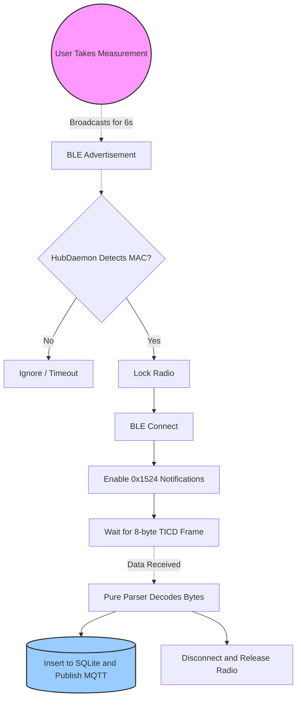
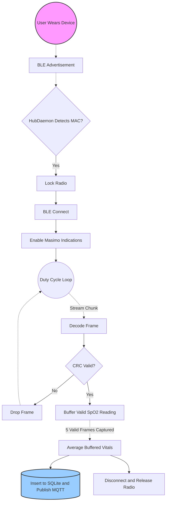
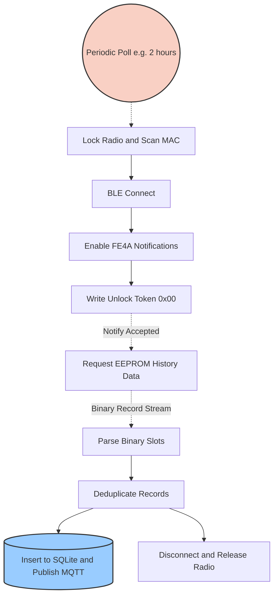

# Device Connection Workflows

This document visualizes the connection lifecycles for the three primary device classes handled by the SH3-PI BLE Hub.

## 1. WINDOWED Class (e.g., Nipro NT-100B Thermometer)
*These devices only broadcast for a few seconds immediately after a measurement is taken. The Hub must capture the advertisement quickly.*

## 2. STREAM Class (e.g., Masimo MightySat Rx)
*These devices stream data continuously while worn. The Hub uses a duty cycle to capture a chunk of data, then disconnects to free the radio for other devices.*

## 3. ALWAYS Class (e.g., Omron BP)
*These devices can be connected to at almost any time (if not asleep). The Hub relies on a periodic timer to poll them for historical records.*

